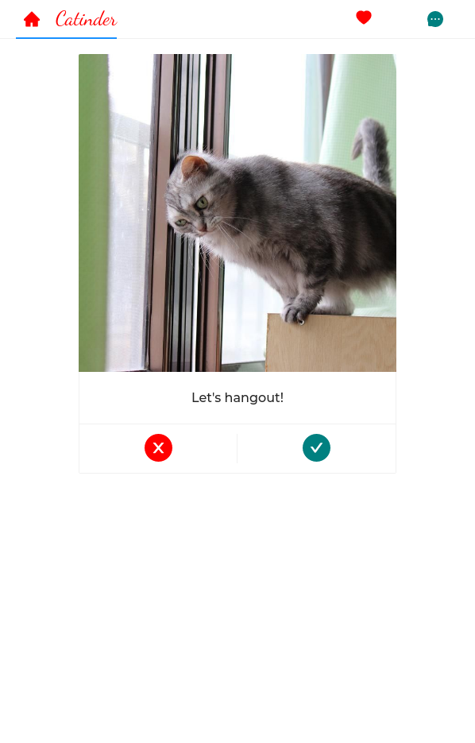
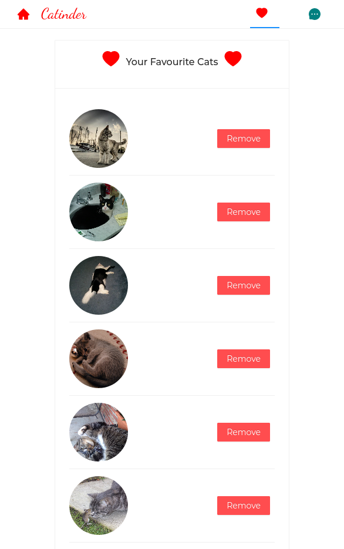

# Catinder
  - Tinder app for cats

### Screenshots
   
   

### System prerequisites
 - nodejs - LTS version
 - yarn or npm

# To run the application locally on your machine

  #### Download project from github using using git
    - Clone the repository
    - Checkout to the root directory of the application

  #### Install depedencies
    - Download all the required packages for the application by running - `pm install`

  #### Setup environment variables
    - Create an .env file at the root directory of your project
    - Add REACT_APP_CAT_API_URL=<cat_api_url> to the .env file
    - Get the cat api key from [cat-api-key](https://docs.thecatapi.com/authentication)
    - Add REACT_APP_CAT_API_KEY=<cat_api_key> to the .env file

  #### Run the application
    - To run the application, run `npm start`

  #### Run run tests
    - checkout to the root directory of the app
    - run `npm test`
